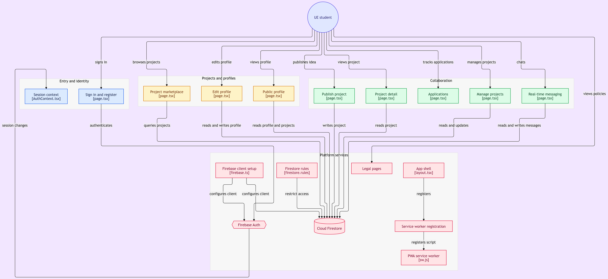
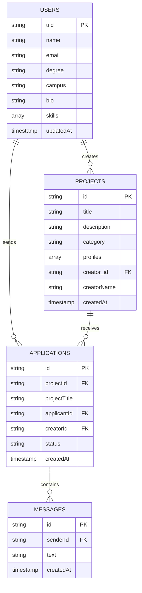

```mermaid
flowchart TD
 
subgraph group_identity["Identity &amp; access"]
  node_login["Sign in / register<br/>[page.tsx]"]
  node_authctx["Auth state<br/>[AuthContext.tsx]"]
  node_guard["Protected routes<br/>[ProtectedRoute.tsx]"]
  node_authsvc{{"Firebase Auth"}}
end
 
subgraph group_collaboration["Project collaboration"]
  node_market["Project marketplace<br/>[page.tsx]"]
  node_newproject["Publish project<br/>[page.tsx]"]
  node_projectdetail["Project details<br/>[page.tsx]"]
  node_applications["My applications<br/>[page.tsx]"]
  node_myprojects["Manage projects<br/>[page.tsx]"]
  node_messages["Direct messaging<br/>[page.tsx]"]
end
 
subgraph group_people["Student profiles"]
  node_profileedit["Edit profile<br/>[page.tsx]"]
  node_publicprofile["View profile<br/>[page.tsx]"]
end
 
subgraph group_platform["App experience"]
  node_firestore[("Cloud Firestore")]
  node_rules["Firestore access rules<br/>[firestore.rules]"]
  node_firebaseclient["Firebase client<br/>[firebase.ts]"]
  node_pwa["PWA manifest<br/>[manifest.ts]"]
  node_swregister["Service worker registration"]
  node_serviceworker["Static asset caching<br/>[sw.js]"]
end
 
node_student(("UE student"))
 
node_student -->|"opens"| node_login
node_login -->|"signs in or registers"| node_authsvc
node_authsvc -->|"notifies auth state"| node_authctx
node_authctx -->|"provides session"| node_guard
node_student -->|"browses projects"| node_market
node_market -->|"uses client"| node_firebaseclient
node_market -->|"queries projects"| node_firestore
node_student -->|"publishes idea"| node_newproject
node_newproject -->|"writes project"| node_firestore
node_market -->|"opens project"| node_projectdetail
node_projectdetail -->|"reads project and applies"| node_firestore
node_student -->|"tracks applications"| node_applications
node_applications -->|"reads application status"| node_firestore
node_student -->|"manages projects"| node_myprojects
node_myprojects -->|"reads and updates records"| node_firestore
node_myprojects -->|"opens applicant chat"| node_messages
node_messages -->|"reads and sends messages"| node_firestore
node_messages -->|"updates read markers"| node_firestore
node_student -->|"maintains profile"| node_profileedit
node_profileedit -->|"reads and saves profile"| node_firestore
node_student -->|"views student"| node_publicprofile
node_publicprofile -->|"reads profile and projects"| node_firestore
node_firebaseclient -->|"configures client"| node_authsvc
node_firebaseclient -->|"configures client"| node_firestore
node_rules -->|"controls access"| node_firestore
node_pwa -->|"enables installation"| node_student
node_swregister -->|"registers"| node_serviceworker
node_serviceworker -->|"caches static assets"| node_student
 
click node_login "https://github.com/markusx5622/CoFound-UE/blob/main/app/page.tsx"
click node_authctx "https://github.com/markusx5622/CoFound-UE/blob/main/context/AuthContext.tsx"
click node_guard "https://github.com/markusx5622/CoFound-UE/blob/main/components/ProtectedRoute.tsx"
click node_market "https://github.com/markusx5622/CoFound-UE/blob/main/app/dashboard/page.tsx"
click node_newproject "https://github.com/markusx5622/CoFound-UE/blob/main/app/dashboard/nuevo/page.tsx"
click node_projectdetail "https://github.com/markusx5622/CoFound-UE/blob/main/app/dashboard/proyecto/%5Bid%5D/page.tsx"
click node_applications "https://github.com/markusx5622/CoFound-UE/blob/main/app/dashboard/mis-postulaciones/page.tsx"
click node_myprojects "https://github.com/markusx5622/CoFound-UE/blob/main/app/dashboard/mis-proyectos/page.tsx"
click node_messages "https://github.com/markusx5622/CoFound-UE/blob/main/app/dashboard/mensajes/page.tsx"
click node_profileedit "https://github.com/markusx5622/CoFound-UE/blob/main/app/perfil/page.tsx"
click node_publicprofile "https://github.com/markusx5622/CoFound-UE/blob/main/app/perfil/%5Buid%5D/page.tsx"
click node_rules "https://github.com/markusx5622/CoFound-UE/blob/main/firestore.rules"
click node_firebaseclient "https://github.com/markusx5622/CoFound-UE/blob/main/lib/firebase.ts"
click node_pwa "https://github.com/markusx5622/CoFound-UE/blob/main/app/manifest.ts"
click node_swregister "https://github.com/markusx5622/CoFound-UE/blob/main/components/ServiceWorkerRegister.tsx"
click node_serviceworker "https://github.com/markusx5622/CoFound-UE/blob/main/public/sw.js"
 
classDef toneNeutral fill:#f8fafc,stroke:#334155,stroke-width:1.5px,color:#0f172a
classDef toneBlue fill:#dbeafe,stroke:#2563eb,stroke-width:1.5px,color:#172554
classDef toneAmber fill:#fef3c7,stroke:#d97706,stroke-width:1.5px,color:#78350f
classDef toneMint fill:#dcfce7,stroke:#16a34a,stroke-width:1.5px,color:#14532d
classDef toneRose fill:#ffe4e6,stroke:#e11d48,stroke-width:1.5px,color:#881337
classDef toneIndigo fill:#e0e7ff,stroke:#4f46e5,stroke-width:1.5px,color:#312e81
classDef toneTeal fill:#ccfbf1,stroke:#0f766e,stroke-width:1.5px,color:#134e4a
class node_login,node_authctx,node_guard,node_authsvc toneBlue
class node_market,node_newproject,node_projectdetail,node_applications,node_myprojects,node_messages toneAmber
class node_profileedit,node_publicprofile toneMint
class node_firestore,node_rules,node_firebaseclient,node_pwa,node_swregister,node_serviceworker toneRose
class node_student toneIndigo
```

<div align="center">

  

  ### *The Exclusive Co-Founders and Talent Platform for the European University*

  [](https://nextjs.org/)
  [](https://www.typescriptlang.org/)
  [](https://tailwindcss.com/)
  [](https://firebase.google.com/)
  [](LICENSE)
  

  🇪🇸 [Versión en español disponible](README.md)
 
  <p align="center">
    <strong>Connect with Business, Marketing, Tech, and Design students to turn university ideas into high-impact startups.</strong>
  
  [Key Features](#-key-features) •
  [Architecture](#-project-architecture) •
  [Application Flow](#-application-flow) •
  [Brief Presentation Video](#-presentation-video-1-min) •
  [Installation](#-installation-and-local-setup) •
  [Data Model](#-data-model-firestore) •
  [Roadmap](#-roadmap) •
  [Deployment](#-deployment)
  
  </p>

  ---

</div>

<br/>

> [!NOTE]
> **Courtesy Translation:** This English version of the README is provided for international readers and exchange students. The primary and legally binding documentation remains in Spanish ([README.md](README.md)).

> [!NOTE]
> **Project in active development:** CoFound UE is a university project in active development for the European University community ([www.cofoundue.es](https://www.cofoundue.es)).

## 📌 Overview

Across a campus with hundreds of students, team formation often boils down to physical proximity in the classroom rather than complementary skillsets. Talent across Business, Engineering, Marketing, Design, and Tech walks the same hallways daily, yet rarely crosses paths productively. Great ideas emerge constantly at university, but often lose momentum in inactive chat groups due to the absence of the right technical or business profiles required to bring them to life.

To resolve this friction, **CoFound UE** was created: a full-stack web platform specifically designed to break academic silos at the **European University**. The application acts as an internal talent marketplace where students and graduates can strategically discover one another, collaborate on interdisciplinary projects, publish academic challenges, find Final Degree Project (TFG) partners, or launch real startups directly from campus.

### 🔑 Value Proposition
* **Institutional Exclusivity:** Strict authentication restricted to European University domains (`@live.uem.es` and `@universidadeuropea.es`).
* **Skill-Based Matchmaking:** Strategic connections between ideators and technical or business builders.
* **Flexible Formats:** Projects categorized into *Academic Challenges*, *Final Degree Projects (TFGs)*, and *Real Startups*.
* **Immersive User Experience:** Modern dark-mode interface featuring dynamic real-time particle animations powered by an interactive canvas.

---

## ✨ Key Features

| Module | Description | Key Technology |
| :--- | :--- | :--- |
| **🛡️ Restricted Auth** | Registration and sign-in validated via regular expressions ensuring access strictly to users with European University institutional emails, with mandatory email verification (hard-gate in UI and Firestore rules). | Firebase Auth & TypeScript regex validation |
| **🎨 Immersive Interface** | Modern dark-mode aesthetics featuring fluid particle canvas, glassmorphism (`backdrop-blur`) effects, and UE institutional color accents (`#E60000`). | Tailwind CSS, Framer Motion & HTML5 Canvas |
| **👤 Student Profiles** | Comprehensive student profile management with locally generated initials avatars (no image storage or external dependencies), full name, degree, campus selection (*Campus Turia / Valencia* and *Campus Alameda / Valencia*, scoped to pilot campuses), bio, and interactive skill tags. | Firestore Document Merge, InitialsAvatar & Sonner Toasts |
| **💡 Project Marketplace** | Real-time central board to browse active projects, filter by challenge category, and explore sought-after roles. | Firestore Queries & Lucide Icons |
| **📝 Project Creator** | Idea publisher featuring categorization, rich description, and dynamic role definition (*e.g., Frontend Developer, Growth Hacker*). | Controlled Dynamic Forms |
| **🤝 Applications & Matching** | One-click application system, self-application prevention, and duplicate prevention. | Realtime Firestore Collections |
| **💬 Real-Time Messaging** | Direct chat between project creator and applicants, secured by Firestore rules allowing access only to both participants. | Firestore Subcollections & Realtime Listeners (`onSnapshot`) |
| **📂 Personal Management** | Dedicated dashboards to manage *My Projects* created and monitor the status of *My Applications*. | Protected Route System |
| **📲 Installable PWA** | Add to home screen (mobile and desktop) with maskable icons, custom service worker, standalone experience, and non-invasive install prompt (max once per session, persistent 30-day dismissal, standalone detection). | Web App Manifest & Service Worker |

---

## 🛠️ Tech Stack

### Frontend & UI
* **[Next.js 14](https://nextjs.org/) (App Router):** React framework for optimized rendering, file-system based routing, and dynamic SEO metadata.
* **[TypeScript](https://www.typescriptlang.org/):** Strict static typing ensuring robustness across props, state, and database contracts.
* **[Tailwind CSS](https://tailwindcss.com/):** Utility-first CSS framework tailored with custom design tokens, backdrop filters, and animations.
* **[Framer Motion](https://www.framer.com/motion/):** Library for fluid animations, interface transitions, and dynamic micro-interactions.
* **[Lucide React](https://lucide.dev/):** Lightweight and consistent vector icon collection.
* **[Sonner](https://sonner.emilkowal.ski/):** Elegant and accessible toast notification system.

### Backend & Services
* **[Firebase Auth](https://firebase.google.com/docs/auth):** Email/password authentication management with localized error handling.
* **[Cloud Firestore](https://firebase.google.com/docs/firestore):** Scalable NoSQL real-time database for users, projects, applications, and messages.
* **[Vercel & Analytics](https://vercel.com/):** Continuous deployment platform optimized for Next.js with real-time performance monitoring and analytics.

---

## 📂 Project Architecture

```
CoFound-UE/
├── .github/                              # GitHub automation and workflows
│   └── workflows/
│       └── ci.yml                        # CI pipeline: lint, emulator tests, build
├── app/                                  # Main routes and pages (Next.js App Router)
│   ├── dashboard/                        # Student main hub (Project marketplace)
│   │   ├── mensajes/                     # Real-time direct chat between creators and applicants
│   │   ├── mis-postulaciones/            # Sent applications tracker
│   │   ├── mis-proyectos/                # Creator project manager
│   │   ├── nuevo/                        # Publish new idea/project form
│   │   ├── proyecto/[id]/                # Project details view and application trigger
│   │   │   ├── editar/                   # Existing project edit form
│   │   │   │   └── page.tsx              # Protected edit view
│   │   │   └── page.tsx                  # Project details and application view
│   │   └── page.tsx                      # Active Projects view (Central Dashboard)
│   ├── legal/                            # Legal compliance and regulatory notices
│   │   ├── aviso-legal/                  # Terms & Conditions documentation
│   │   ├── cookies/                      # Cookies Policy
│   │   └── privacidad/                   # Data Privacy Policy
│   ├── perfil/                           # Student university profile
│   │   ├── [uid]/                        # Public profile view for other students
│   │   └── page.tsx                      # Personal info, campus, and skills management
│   ├── globals.css                       # Global styles and Tailwind extensions
│   ├── layout.tsx                        # Root layout with particle background, PWA, and Toaster
│   ├── manifest.ts                       # PWA metadata generator (Web App Manifest)
│   ├── page.tsx                          # Landing Page with integrated Login/Registration form
│   ├── robots.ts                         # Dynamic robots.txt generator with canonical host
│   └── sitemap.ts                        # Dynamic sitemap.xml generator with canonical URLs
├── components/                           # Reusable UI components
│   ├── ui/                               # Primitives and base visual elements (Skeleton loaders)
│   ├── campus-feed-preview.tsx           # Interactive social feed on Landing
│   ├── footer.tsx                        # Footer with legal links and public GitHub repository link
│   ├── hero-section.tsx                  # Main welcome and high-impact visual section
│   ├── how-it-works.tsx                  # Step-by-step platform walkthrough
│   ├── InitialsAvatar.tsx                # Local initials avatar generator (privacy by design)
│   ├── Navbar.tsx                        # Responsive navigation bar with user state
│   ├── particle-background.tsx           # HTML5 Canvas particle matrix effect
│   ├── ProtectedRoute.tsx                # Private route guardian with verified email hard-gate
│   ├── PwaInstallPrompt.tsx              # Non-invasive PWA install prompt (session, 30d dismiss, standalone)
│   ├── ServiceWorkerRegister.tsx         # PWA Service Worker registration in production
│   └── student-faq.tsx                   # Student FAQ accordion on Landing
├── context/                              # Global React contexts
│   ├── AuthContext.tsx                   # User authentication provider and hook
│   └── LanguageContext.tsx               # Internationalization (ES/EN) provider and hook
├── lib/                                  # Business logic, i18n dictionaries, and utilities
│   ├── i18n/                             # Dictionary files for bilingual support
│   │   ├── en.ts                         # English translations (strictly typed)
│   │   └── es.ts                         # Spanish translations (canonical source & Dictionary type)
│   ├── auth-errors.ts                    # Firebase Auth error code mapper with i18n keys
│   ├── firebase.ts                       # Firebase SDK, Auth, and Firestore initialization
│   └── site.ts                           # SITE_URL constant, single source of truth for canonical domain
├── public/                               # Static assets and PWA files
│   ├── icons/                            # Responsive and maskable PWA icons
│   ├── CoFoundUE_banner.png              # Brand banner (README / landing)
│   ├── CoFoundUE_logo.png                # Official CoFound UE logo
│   ├── Diagrama_CoFoundUE.png            # Architecture flowchart (optimized to ~272 KB)
│   ├── og-image.jpg                      # Optimized OpenGraph preview image (1200x630)
│   └── sw.js                             # Service Worker for PWA offline caching
├── tests/                                # Automated test suite
│   └── rules.test.ts                     # Firestore security rules tests with Vitest and local emulator
├── CoFound UE — Protocolo de Smoke Test.md # Pre-pilot manual testing protocol
├── firebase.json                         # Firebase configuration and local emulator ports
├── firestore.indexes.json                # Firestore composite index definitions
├── firestore.rules                       # Firestore security rules (verified email required, granular access, messaging)
├── LICENSE                               # Proprietary license (All rights reserved)
├── next.config.mjs                       # Next.js config: 308 apex/subdomain redirect to www.cofoundue.es and SW headers
├── package.json                          # Dependencies, scripts, and metadata
├── postcss.config.mjs                    # CSS processing plugins (Autoprefixer, Tailwind)
├── tailwind.config.ts                    # Tailwind theme configuration
└── tsconfig.json                         # TypeScript compiler configuration
```

## 🎬 Presentation Video (1 min)
 
<p align="center">
  <video src="https://github.com/user-attachments/assets/72fc2bfa-cadf-4fb2-82eb-405d10ed539b" width="100%" controls></video>
</p>
<p align="center"><em>Prefer viewing directly? <a href="https://gitdiagram.com/markusx5622/cofound-ue/video">Open on GitDiagram</a></em></p>
<br/>

## 🔄 Application Flow
 
The following diagram traces the student's journey across the platform, organized by domain (identity, project collaboration, profiles, and platform experience), alongside the source files backing each node. It is presented as a pre-rendered image for optimal layout clarity; the underlying source code remains available below for inspection:
 
<p align="center">
  
</p>

---

<details>
<summary>View Mermaid source code (to edit or re-render the diagram)</summary>
  

 
</details>

---

## ⚡ Installation and Local Setup

Follow these steps to run **CoFound UE** in your local environment:

### 1. Prerequisites
Ensure you have installed:
* **Node.js**: Version `18.x` or higher.
* **npm**, **yarn**, **pnpm**, or **bun**.

### 2. Clone the Repository
```bash
git clone https://github.com/markusx5622/CoFound-UE.git
cd CoFound-UE
```

### 3. Install Dependencies
```bash
npm install
```

### 4. Configure Environment Variables
Create a `.env.local` file in the root directory and add your **Firebase** credentials:

```env
NEXT_PUBLIC_FIREBASE_API_KEY=your_firebase_api_key
NEXT_PUBLIC_FIREBASE_AUTH_DOMAIN=your_project.firebaseapp.com
NEXT_PUBLIC_FIREBASE_PROJECT_ID=your_project_id
NEXT_PUBLIC_FIREBASE_STORAGE_BUCKET=your_project.appspot.com
NEXT_PUBLIC_FIREBASE_MESSAGING_SENDER_ID=your_messaging_sender_id
NEXT_PUBLIC_FIREBASE_APP_ID=your_app_id
```

### 5. Start the Development Server
```bash
npm run dev
```
Open your browser and navigate to [http://localhost:3000](http://localhost:3000).

---

## 💾 Data Model (Firestore)

The application organizes data in **Firebase Firestore** across primary collections and a real-time messaging subcollection:



---

## 📜 Available Scripts

In the project directory, you can run:

| Command | Description |
| :--- | :--- |
| `npm run dev` | Runs the app in development mode with Hot Module Replacement (HMR). |
| `npm run build` | Compiles the production-optimized application into the `.next` directory. |
| `npm run start` | Starts a Next.js production server. |
| `npm run lint` | Runs ESLint to detect code and style issues. |
| `npm test` | Runs the Firestore rules test suite with Vitest (requires emulator). |

---

## 🧪 Testing

The project includes an automated unit testing environment configured with **Vitest** and the local Firestore Emulator to rigorously validate security rules (`firestore.rules`). The current test suite consists of **23 tests** validating access control, write field validations, and the rejection of unverified users.

### Run tests locally
Make sure dependencies are installed (`npm install`). To launch the emulator and execute the test suite, run:
```bash
npx --yes firebase-tools emulators:exec --only firestore --project cofound-ue-test "npm test"
```

The GitHub Actions CI pipeline executes this suite automatically on every `push` to the `main` branch.

---

## 🔒 Security Policies & Auth Validation

The platform incorporates a multi-layer validation engine to safeguard the university ecosystem:

1. **Mandatory Institutional Email:**
   Sign-in and sign-up strictly require emails ending with:
   - `@live.uem.es` *(Students)*
   - `@universidadeuropea.es` *(Faculty / Staff)*
2. **Protected Routes (`ProtectedRoute.tsx`):**
   Internal views (`/dashboard`, `/perfil`, `/dashboard/nuevo`, `/dashboard/proyecto/[id]`, `/dashboard/mensajes`, etc.) verify the active Firebase Auth session before granting access, redirecting to the Landing Page if unauthenticated. Furthermore, verified email acts as an absolute gate (hard-gate): if `user.emailVerified == false`, the entire internal UI is blocked by a verification screen offering email resending with a 60-second cooldown and `auth/too-many-requests` handling.
3. **Strict Security Rules (`firestore.rules`):**
   Granular access in Firestore: users can only edit their own profile, creators manage their projects, and the messages subcollection is strictly limited to the two participants of the application (creator and applicant), preventing any unauthorized access. In production, `isAuthenticated()` requires `request.auth.token.email_verified == true`: unverified users are blocked from direct SDK/REST requests; and rules validate write fields: title 3–100 chars, description 20–1500 chars, 1–10 profiles, `creatorName` mandatory, messages 1–1000 chars.
4. **Automated CI Coverage:**
   The 23-test suite (`tests/rules.test.ts`, Vitest + emulator) covers role-based access control, write validation, and unverified user rejection. CI executes this on every push to main.

---

## 🌐 Deployment

The platform is optimized for deployment on **Vercel** or any Next.js-compatible platform:

1. Connect your GitHub repository to **Vercel**.
2. In the project settings, configure the Firebase environment variables (`NEXT_PUBLIC_FIREBASE_*`).
3. Vercel will automatically detect Next.js 14 and trigger the build.

Live production URL: **[https://www.cofoundue.es](https://www.cofoundue.es)**

---

## 🗺️ Roadmap

The roadmap of **CoFound UE** is structured into strategic phases designed to consolidate the platform and serve campus needs:

* **Completed:**
  * **Phase 0:** Institutional Auth (`@live.uem.es` / `@universidadeuropea.es`), Firestore security rules, and cascading project deletions.
  * **Phase 1:** Project marketplace, application workflow, and university profiles.
  * **Phase 2:** Real-time messaging, user profiles, and skeleton loaders.
  * **Phase 3A:** Installable PWA, custom domain (`www.cofoundue.es`), technical SEO (Sitemap, Robots), and CI with automated Firestore rules tests.
  * **Phase 3B:** Security hardening (verified email enforced in rules and UI hard-gate), SEO unification to canonical domain `www.cofoundue.es` (metadataBase, og:url, canonical, 308 redirect from Vercel subdomain), orphaned asset cleanup (−8.2 MB), non-invasive PWA prompt, and pilot expansion to Turia and Alameda campuses.

* **In Progress / Upcoming Phases:**
  * Full ES/EN internationalization with language selector (predominantly international campus).
  * Comprehensive smoke test execution and pilot launch at Turia and Alameda campuses.
  * Transactional email notifications.
  * Global project search.
  * Creator metrics dashboard.

---

## 📬 Pilot at Turia and Alameda Campuses & Contact

CoFound UE was born under the *learning by doing* philosophy of our university. As such, the initial rollout is structured as an **on-campus pilot across both Valencia sites (Turia —Guillem de Castro 175— and Alameda —Paseo de la Alameda 7—)** this semester. The two campuses are located 20–25 minutes on foot from each other and form a single shared talent market, ensuring high-quality matchmaking and delivering immediate value for student projects and courses.

To evaluate product traction and viability in this real environment, the pilot is monitored using clear strategic KPIs: weekly active users (WAU), application conversion rate (submitted applications vs. completed teams), and Time-to-Match (average time from project publication to team completion).

The success of any digital product depends on constant user-driven iteration. If you are a student with feedback or ideas, or faculty wishing to integrate the platform into your coursework to facilitate student teaming, we would love to hear from you.

Your feedback is essential to sustainably scaling the tool. Share your thoughts, report issues, or propose strategic collaborations by contacting us directly at: **cofoundue@gmail.com**

---

## 📄 License

**Copyright © 2026 Marc Cubero Cantavella — All rights reserved.**

This project, including its source code, design, algorithms, and documentation, is the exclusive intellectual property of its author. No license is granted for use, reproduction, modification, distribution, or commercial exploitation without prior written consent. The presence of this code in a public repository is strictly for demonstration and professional portfolio purposes.

Refer to the [`LICENSE`](./LICENSE) file for more information.

---

<div align="center">
  <sub>Developed with ❤️ for the <strong>European University</strong> community.</sub>
</div>
