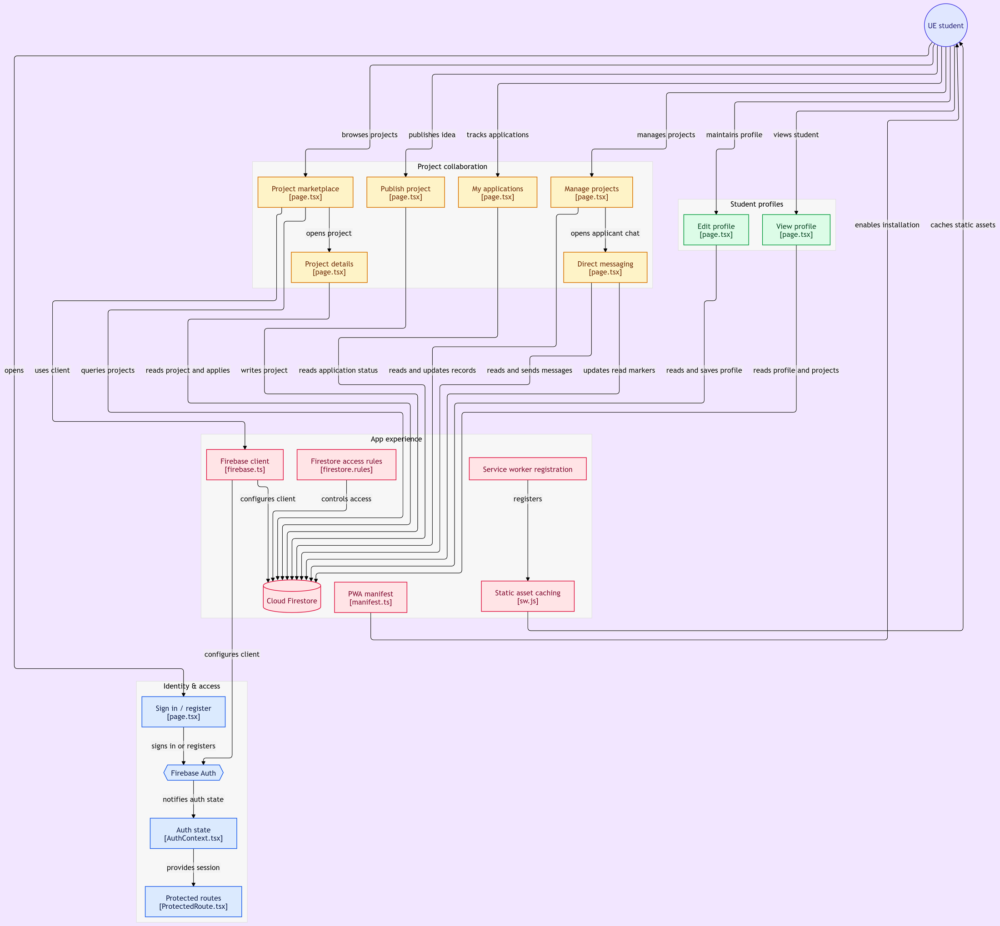
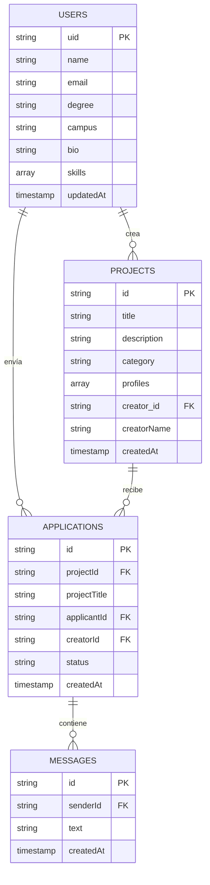

<div align="center">

  

  ### *La Plataforma Exclusiva de Co-Founders y Talento para la Universidad Europea*

  [](https://nextjs.org/)
  [](https://www.typescriptlang.org/)
  [](https://tailwindcss.com/)
  [](https://firebase.google.com/)
  [](LICENSE)
  

  <p align="center">
    <strong>Conecta con estudiantes de ADE, Marketing, Tech y Diseño para transformar ideas universitarias en startups de alto impacto.</strong>
  </p>

  [Explorar Características](#-características-principales) •
  [Arquitectura](#-arquitectura-del-proyecto) •
  [Instalación](#-instalación-y-configuración-local) •
  [Modelo de Datos](#-modelo-de-datos-firestore) •
  [Roadmap](#-roadmap) •
  [Despliegue](#-despliegue)

  ---

  

</div>

<br/>

> [!NOTE]
> **Proyecto en desarrollo activo:** CoFound UE es la plataforma prioritaria y en desarrollo activo para la comunidad de la Universidad Europea ([cofoundue.es](https://cofoundue.es)).

## 📌 Visión General

**CoFound UE** es una plataforma web full-stack diseñada específicamente para la comunidad académica y emprendedora de la **Universidad Europea**. 

La aplicación resuelve la fragmentación del talento dentro del campus universitario, permitiendo a estudiantes y graduados de diversas áreas (Business, Ingeniería, Software, Diseño, Marketing, etc.) encontrarse, colaborar en proyectos interdisciplinarios, publicar retos académicos, Trabajos de Fin de Grado (TFG) o lanzar *startups*.

### 🔑 Propuesta de Valor
* **Exclusividad Institucional:** Autenticación estricta restringida a dominios de la universidad (`@live.uem.es` y `@universidadeuropea.es`).
* **Matchmaking por Habilidades:** Conexión estratégica entre creadores de ideas e integradores técnicos o de negocio.
* **Formatos Flexibles:** Proyectos categorizados en *Retos Académicos*, *TFGs* y *Startups Reales*.
* **Experiencia de Usuario Inmersiva:** Interfaz en modo oscuro moderna con animaciones dinámicas de partículas en tiempo real mediante canvas interactivo.

---

## ✨ Características Principales

| Módulo | Descripción | Tecnología Clave |
| :--- | :--- | :--- |
| **🛡️ Auth Restringida** | Registro e inicio de sesión validado mediante expresión regular para asegurar el acceso únicamente a usuarios con correo institucional de la Universidad Europea. | Firebase Auth & TypeScript regex validation |
| **🎨 Interfaz Inmersiva** | Estética *dark-mode* moderna con canvas de partículas fluidas, efectos glassmorphism (`backdrop-blur`) y acentos de color institucional de la UE (`#E60000`). | Tailwind CSS, Framer Motion & HTML5 Canvas |
| **👤 Perfiles de Estudiantes** | Gestión completa del perfil del alumno con avatares de iniciales generados localmente (sin almacenamiento de imágenes ni dependencias externas), nombre, titulación, selección de campus (*Campus Turia / Valencia, Villaviciosa, Alcobendas, Alicante, Málaga, Canarias, Online*), biografía y tags interactivos de habilidades. | Firestore Document Merge, InitialsAvatar & Sonner Toasts |
| **💡 Marketplace de Proyectos** | Tablero central en tiempo real para visualizar proyectos activos, filtrar por tipo de reto y explorar perfiles requeridos. | Firestore Queries & Lucide Icons |
| **📝 Creador de Proyectos** | Publicador de ideas con categorización, descripción detallada y definidor dinámico de perfiles buscados (*ej: Frontend Developer, Growth Hacker*). | Controlled Dynamic Forms |
| **🤝 Postulaciones & Matching** | Sistema de un clic para postularse a iniciativas, prevención de autopostulaciones y control de duplicados. | Realtime Firestore Collections |
| **💬 Mensajería en tiempo real** | Chat directo entre el creador del proyecto y los postulantes, con acceso restringido por reglas de Firestore a ambas partes. | Firestore Subcollections & Realtime Listeners (`onSnapshot`) |
| **📂 Gestión Personal** | Paneles dedicados para administrar *Mis Proyectos* creados y monitorear el estado de *Mis Postulaciones*. | Protected Route System |
| **📲 PWA Instalable** | Instalación en pantalla de inicio (móvil y escritorio) con iconos maskable, service worker propio y experiencia standalone. | Web App Manifest & Service Worker |

---

## 🛠️ Stack Tecnológico

### Frontend & UI
* **[Next.js 14](https://nextjs.org/) (App Router):** Framework React para renderizado optimizado, routing basado en el sistema de archivos y metadatos SEO dinámicos.
* **[TypeScript](https://www.typescriptlang.org/):** Tipado estático estricto para garantizar robustez en props, estado y contratos con la base de datos.
* **[Tailwind CSS](https://tailwindcss.com/):** Framework de CSS utility-first adaptado con tokens de diseño personalizados, utilidades de filtrado y animaciones.
* **[Framer Motion](https://www.framer.com/motion/):** Librería para animaciones fluidas, transiciones de interfaz y microinteracciones dinámicas.
* **[Lucide React](https://lucide.dev/):** Conjunto de iconos vectoriales ligeros y consistentes.
* **[Sonner](https://sonner.emilkowal.ski/):** Sistema de notificaciones toast elegantes y accesibles.

### Backend & Servicios
* **[Firebase Auth](https://firebase.google.com/docs/auth):** Manejo de autenticación basada en email y contraseña con control de errores localizado en español.
* **[Cloud Firestore](https://firebase.google.com/docs/firestore):** Base de datos NoSQL escalable para el almacenamiento en tiempo real de usuarios, proyectos, postulaciones y mensajes.
* **[Vercel & Analytics](https://vercel.com/):** Plataforma de despliegue continuo optimizada para Next.js con monitorización de rendimiento y analíticas en tiempo real.

---

## 📂 Arquitectura del Proyecto

```
CoFound-UE/
├── .github/                    # Automatización y flujos de trabajo de GitHub
│   └── workflows/
│       └── ci.yml              # Pipeline CI: lint, tests con emulador, build
├── app/                        # Rutas y páginas principales (Next.js App Router)
│   ├── dashboard/              # Panel principal del estudiante (Marketplace de proyectos)
│   │   ├── mensajes/           # Chat y mensajería en tiempo real entre creadores y postulantes
│   │   ├── mis-postulaciones/  # Rastreador de postulaciones enviadas
│   │   ├── mis-proyectos/      # Gestor de proyectos creados por el usuario
│   │   ├── nuevo/              # Formulario para publicar una nueva idea/proyecto
│   │   ├── proyecto/[id]/      # Vista detallada de un proyecto y botón de postulación
│   │   └── page.tsx            # Vista de Proyectos Activos (Dashboard central)
│   ├── legal/                  # Cumplimiento normativo y aviso legal
│   │   ├── aviso-legal/        # Documentación de Términos y Condiciones
│   │   ├── cookies/            # Política de Galletas / Cookies
│   │   └── privacidad/         # Política de Privacidad de Datos
│   ├── perfil/                 # Perfil universitario del estudiante
│   │   ├── [uid]/              # Vista de perfil público de otros estudiantes
│   │   └── page.tsx            # Gestión de datos personales, campus y habilidades
│   ├── globals.css             # Estilos globales y extensiones Tailwind
│   ├── layout.tsx              # Estructura raíz con fondo interactivo, PWA y Toaster
│   ├── manifest.ts             # Generador de metadatos de la PWA (Web App Manifest)
│   └── page.tsx                # Landing Page con formulario de Login/Registro integrados
├── components/                 # Componentes de UI reutilizables
│   ├── ui/                     # Primitivas y componentes visuales base (Skeleton loaders)
│   ├── campus-feed-preview.tsx # Muro social interactivo de la Landing
│   ├── features-section.tsx    # Cuadrícula de características destacadas en Landing
│   ├── footer.tsx              # Pie de página institucional con enlaces legales
│   ├── hero-section.tsx        # Sección principal de bienvenida e impacto visual
│   ├── how-it-works.tsx        # Guía paso a paso sobre el funcionamiento de la red
│   ├── InitialsAvatar.tsx      # Generador local de avatares con iniciales (privacidad por diseño)
│   ├── Navbar.tsx              # Barra de navegación adaptativa con estado de usuario
│   ├── particle-background.tsx # Canvas HTML5 con efecto matricial de partículas
│   ├── ProtectedRoute.tsx      # HOC / Guardián para proteger rutas privadas
│   ├── ServiceWorkerRegister.tsx # Registro del Service Worker PWA en entornos de producción
│   └── vision-section.tsx      # Sección de visión institucional y proyección
├── context/                    # Contextos globales de React
│   └── AuthContext.tsx         # Proveedor y hook de autenticación de usuario
├── lib/                        # Lógica de negocio y utilidades
│   ├── auth-errors.ts          # Mapeo de errores de Firebase Auth a lenguaje amigable (ES)
│   └── firebase.ts             # Inicialización del SDK de Firebase, Auth y Firestore
├── public/                     # Recursos estáticos y PWA
│   ├── icons/                  # Iconos PWA responsivos y maskable para dispositivos
│   ├── CoFoundUE_banner.png    # Banner de marca (README / landing)
│   ├── CoFoundUE_logo.png      # Logotipo oficial de CoFound UE
│   ├── og-image.jpg            # Imagen OpenGraph optimizada para previsualizaciones (1200x630)
│   └── sw.js                   # Service Worker para capacidades PWA y caché offline
├── tests/                      # Suite de pruebas automatizadas
│   └── rules.test.ts           # Tests de reglas Firestore con Vitest y emulador local
├── firestore.indexes.json      # Definición de índices compuestos de Firestore
├── firestore.rules             # Reglas de seguridad de Firestore (Auth, accesos y mensajería)
├── LICENSE                     # Licencia propietaria (Todos los derechos reservados)
├── next.config.mjs             # Configuración de compilación Next.js
├── package.json                # Dependencias, scripts y metadatos
├── postcss.config.mjs          # Plugins de procesamiento CSS (Autoprefixer, Tailwind)
├── tailwind.config.ts          # Configuración del tema Tailwind
└── tsconfig.json               # Reglas del compilador de TypeScript
```

## 🔄 Flujo de la Aplicación
 
El siguiente diagrama traza el recorrido funcional del estudiante a través de la plataforma, agrupado por dominio (identidad, colaboración en proyectos, perfiles y experiencia de la app), junto con los ficheros que implementan cada nodo. Se muestra como imagen pre-renderizada porque el grafo tiene demasiadas conexiones cruzadas de largo alcance para que el motor de layout de Mermaid lo ajuste con fidelidad al ancho fijo del visor de GitHub; el código fuente sigue disponible más abajo para poder editarlo:
 
<p align="center">
  
</p>

---

flowchart TD

subgraph group_identity["Identity &amp; access"]
  node_login["Sign in / register<br/>[page.tsx]"]
  node_authctx["Auth state<br/>[AuthContext.tsx]"]
  node_guard["Protected routes<br/>[ProtectedRoute.tsx]"]
  node_authsvc{{"Firebase Auth"}}
end

subgraph group_collaboration["Project collaboration"]
  node_market["Project marketplace<br/>[page.tsx]"]
  node_newproject["Publish project<br/>[page.tsx]"]
  node_projectdetail["Project details<br/>[page.tsx]"]
  node_applications["My applications<br/>[page.tsx]"]
  node_myprojects["Manage projects<br/>[page.tsx]"]
  node_messages["Direct messaging<br/>[page.tsx]"]
end

subgraph group_people["Student profiles"]
  node_profileedit["Edit profile<br/>[page.tsx]"]
  node_publicprofile["View profile<br/>[page.tsx]"]
end

subgraph group_platform["App experience"]
  node_firestore[("Cloud Firestore")]
  node_rules["Firestore access rules<br/>[firestore.rules]"]
  node_firebaseclient["Firebase client<br/>[firebase.ts]"]
  node_pwa["PWA manifest<br/>[manifest.ts]"]
  node_swregister["Service worker registration"]
  node_serviceworker["Static asset caching<br/>[sw.js]"]
end

node_student(("UE student"))

node_student -->|"opens"| node_login
node_login -->|"signs in or registers"| node_authsvc
node_authsvc -->|"notifies auth state"| node_authctx
node_authctx -->|"provides session"| node_guard
node_student -->|"browses projects"| node_market
node_market -->|"uses client"| node_firebaseclient
node_market -->|"queries projects"| node_firestore
node_student -->|"publishes idea"| node_newproject
node_newproject -->|"writes project"| node_firestore
node_market -->|"opens project"| node_projectdetail
node_projectdetail -->|"reads project and applies"| node_firestore
node_student -->|"tracks applications"| node_applications
node_applications -->|"reads application status"| node_firestore
node_student -->|"manages projects"| node_myprojects
node_myprojects -->|"reads and updates records"| node_firestore
node_myprojects -->|"opens applicant chat"| node_messages
node_messages -->|"reads and sends messages"| node_firestore
node_messages -->|"updates read markers"| node_firestore
node_student -->|"maintains profile"| node_profileedit
node_profileedit -->|"reads and saves profile"| node_firestore
node_student -->|"views student"| node_publicprofile
node_publicprofile -->|"reads profile and projects"| node_firestore
node_firebaseclient -->|"configures client"| node_authsvc
node_firebaseclient -->|"configures client"| node_firestore
node_rules -->|"controls access"| node_firestore
node_pwa -->|"enables installation"| node_student
node_swregister -->|"registers"| node_serviceworker
node_serviceworker -->|"caches static assets"| node_student

click node_login "https://github.com/markusx5622/CoFound-UE/blob/main/app/page.tsx"
click node_authctx "https://github.com/markusx5622/CoFound-UE/blob/main/context/AuthContext.tsx"
click node_guard "https://github.com/markusx5622/CoFound-UE/blob/main/components/ProtectedRoute.tsx"
click node_market "https://github.com/markusx5622/CoFound-UE/blob/main/app/dashboard/page.tsx"
click node_newproject "https://github.com/markusx5622/CoFound-UE/blob/main/app/dashboard/nuevo/page.tsx"
click node_projectdetail "https://github.com/markusx5622/CoFound-UE/blob/main/app/dashboard/proyecto/%5Bid%5D/page.tsx"
click node_applications "https://github.com/markusx5622/CoFound-UE/blob/main/app/dashboard/mis-postulaciones/page.tsx"
click node_myprojects "https://github.com/markusx5622/CoFound-UE/blob/main/app/dashboard/mis-proyectos/page.tsx"
click node_messages "https://github.com/markusx5622/CoFound-UE/blob/main/app/dashboard/mensajes/page.tsx"
click node_profileedit "https://github.com/markusx5622/CoFound-UE/blob/main/app/perfil/page.tsx"
click node_publicprofile "https://github.com/markusx5622/CoFound-UE/blob/main/app/perfil/%5Buid%5D/page.tsx"
click node_rules "https://github.com/markusx5622/CoFound-UE/blob/main/firestore.rules"
click node_firebaseclient "https://github.com/markusx5622/CoFound-UE/blob/main/lib/firebase.ts"
click node_pwa "https://github.com/markusx5622/CoFound-UE/blob/main/app/manifest.ts"
click node_swregister "https://github.com/markusx5622/CoFound-UE/blob/main/components/ServiceWorkerRegister.tsx"
click node_serviceworker "https://github.com/markusx5622/CoFound-UE/blob/main/public/sw.js"

classDef toneNeutral fill:#f8fafc,stroke:#334155,stroke-width:1.5px,color:#0f172a
classDef toneBlue fill:#dbeafe,stroke:#2563eb,stroke-width:1.5px,color:#172554
classDef toneAmber fill:#fef3c7,stroke:#d97706,stroke-width:1.5px,color:#78350f
classDef toneMint fill:#dcfce7,stroke:#16a34a,stroke-width:1.5px,color:#14532d
classDef toneRose fill:#ffe4e6,stroke:#e11d48,stroke-width:1.5px,color:#881337
classDef toneIndigo fill:#e0e7ff,stroke:#4f46e5,stroke-width:1.5px,color:#312e81
classDef toneTeal fill:#ccfbf1,stroke:#0f766e,stroke-width:1.5px,color:#134e4a
class node_login,node_authctx,node_guard,node_authsvc toneBlue
class node_market,node_newproject,node_projectdetail,node_applications,node_myprojects,node_messages toneAmber
class node_profileedit,node_publicprofile toneMint
class node_firestore,node_rules,node_firebaseclient,node_pwa,node_swregister,node_serviceworker toneRose
class node_student toneIndigo

---

## ⚡ Instalación y Configuración Local

Sigue estos pasos para ejecutar **CoFound UE** en tu entorno local:

### 1. Prerrequisitos
Asegúrate de tener instalados:
* **Node.js**: Versión `18.x` o superior.
* **npm**, **yarn**, **pnpm** o **bun**.

### 2. Clonar el Repositorio
```bash
git clone https://github.com/markusx5622/CoFound-UE.git
cd CoFound-UE
```

### 3. Instalar Dependencias
```bash
npm install
```

### 4. Configurar Variables de Entorno
Crea un archivo `.env.local` en la raíz del proyecto y añade tus credenciales de **Firebase**:

```env
NEXT_PUBLIC_FIREBASE_API_KEY=tu_firebase_api_key
NEXT_PUBLIC_FIREBASE_AUTH_DOMAIN=tu_proyecto.firebaseapp.com
NEXT_PUBLIC_FIREBASE_PROJECT_ID=tu_proyecto_id
NEXT_PUBLIC_FIREBASE_STORAGE_BUCKET=tu_proyecto.appspot.com
NEXT_PUBLIC_FIREBASE_MESSAGING_SENDER_ID=tu_messaging_sender_id
NEXT_PUBLIC_FIREBASE_APP_ID=tu_app_id
```

### 5. Iniciar el Servidor de Desarrollo
```bash
npm run dev
```
Abre tu navegador y entra en [http://localhost:3000](http://localhost:3000).

---

## 💾 Modelo de Datos (Firestore)

El proyecto organiza sus datos en **Firebase Firestore** estructurados en colecciones principales y la subcolección de mensajería en tiempo real:



---

## 📜 Scripts Disponibles

En el directorio del proyecto, puedes ejecutar:

| Comando | Descripción |
| :--- | :--- |
| `npm run dev` | Inicia la aplicación en modo desarrollo con Hot Module Replacement (HMR). |
| `npm run build` | Compila la aplicación optimizada para producción en el directorio `.next`. |
| `npm run start` | Inicia un servidor de producción de Next.js. |
| `npm run lint` | Ejecuta el linter de ESLint para detectar errores de código y estilo. |
| `npm test` | Ejecuta la suite de tests de reglas de Firestore con Vitest (requiere el emulador). |

---

## 🧪 Pruebas (Testing)

El proyecto cuenta con un entorno de pruebas unitarias configurado con **Vitest** y el Emulador local de Firestore para validar rigurosamente las reglas de seguridad (`firestore.rules`).

### Ejecutar tests localmente
Asegúrate de haber instalado las dependencias (`npm install`). Para lanzar el emulador y correr la suite de tests, ejecuta:
```bash
npx --yes firebase-tools emulators:exec --only firestore --project cofound-ue-test "npm test"
```

El pipeline de CI en GitHub Actions ejecutará esta suite automáticamente en cada `push` a la rama `main`.

---

## 🔒 Políticas de Seguridad y Validación Auth

La aplicación incluye un motor de validación para proteger el ecosistema universitario:

1. **Email Institucional Mandatorio:**
   Se requiere que el correo introducido al iniciar sesión o registrarse finalice formalmente en:
   - `@live.uem.es` *(Alumnos)*
   - `@universidadeuropea.es` *(Personal / Docentes)*
2. **Rutas Protegidas (`ProtectedRoute.tsx`):**
   Las vistas internas (`/dashboard`, `/perfil`, `/dashboard/nuevo`, `/dashboard/proyecto/[id]`, `/dashboard/mensajes`, etc.) verifican la sesión activa en Firebase Auth antes de conceder acceso, redirigiendo automáticamente a la Landing Page si el usuario no se encuentra autenticado.
3. **Reglas de Seguridad Estrictas (`firestore.rules`):**
   Acceso granular en Firestore: usuarios solo editan su propio perfil, creadores gestionan sus proyectos, y la subcolección de mensajes está estrictamente restringida a los dos participantes de la postulación (creador y postulante), bloqueando cualquier acceso cruzado no autorizado.

---

## 🌐 Despliegue

La plataforma está optimizada para ser desplegada en **Vercel** o plataformas compatibles con Next.js:

1. Conecta tu repositorio de GitHub con **Vercel**.
2. En la configuración del proyecto, agrega las variables de entorno de Firebase (`NEXT_PUBLIC_FIREBASE_*`).
3. Vercel detectará automáticamente Next.js 14 y ejecutará la compilación.

URL de producción activa: **[https://cofoundue.es](https://cofoundue.es)**

---

## 🗺️ Roadmap

El desarrollo de **CoFound UE** se organiza en fases estratégicas orientadas a consolidar la plataforma y responder a las necesidades reales del campus:

* **Completado:**
  * **Fase 0:** Auth institucional (`@live.uem.es` / `@universidadeuropea.es`), reglas de seguridad de Firestore y borrado de proyectos en cascada.
  * **Fase 1:** Marketplace de proyectos, sistema de postulaciones y perfiles universitarios.
  * **Fase 2:** Mensajería en tiempo real, perfiles de usuario y *skeleton loaders*.
  * **Fase 3A:** PWA instalable, dominio custom (`cofoundue.es`), SEO técnico (Sitemap, Robots) y CI con tests automatizados de reglas Firestore.

* **En curso / Próximas fases:**
  * Notificaciones transaccionales por email.
  * Buscador global de proyectos.
  * Dashboard de métricas para creadores.

---

## 📄 Licencia

**Copyright © 2026 Marc Cubero Cantavella — Todos los derechos reservados.**

Este proyecto, incluyendo su código fuente, diseño, algoritmos y documentación, es propiedad intelectual exclusiva de su autor. No se concede ningún derecho de uso, copia, modificación, distribución o explotación sin autorización previa y por escrito. La presencia de este código en un repositorio público cumple una función estrictamente demostrativa y de portafolio profesional.

Consulta el archivo [`LICENSE`](./LICENSE) para obtener más detalles.

---

<div align="center">
  <sub>Desarrollado con ❤️ para la comunidad de la <strong>Universidad Europea</strong>.</sub>
</div>
