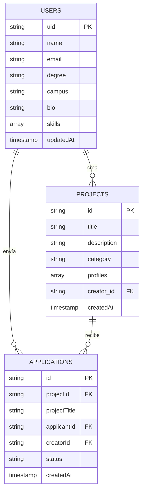

<div align="center">

  

  # 🚀 CoFound UE
  ### *La Plataforma Exclusiva de Co-Founders y Talento para la Universidad Europea*

  [](https://nextjs.org/)
  [](https://www.typescriptlang.org/)
  [](https://tailwindcss.com/)
  [](https://firebase.google.com/)
  [](LICENSE)

  <p align="center">
    <strong>Conecta con estudiantes de ADE, Marketing, Tech y Diseño para transformar ideas universitarias en startups de alto impacto.</strong>
  </p>

  [Explorar Características](#-características-principales) •
  [Arquitectura](#-arquitectura-del-proyecto) •
  [Instalación](#-instalación-y-configuración-local) •
  [Modelo de Datos](#-modelo-de-datos-firestore) •
  [Despliegue](#-despliegue)

  ---

  

</div>

<br/>

> [!NOTE]
> **Experimento archivado:** CoFound UE fue el primer experimento de comunidad exclusiva de la Universidad Europea. Sus aprendizajes sobre autenticación institucional y matching entre estudiantes evolucionaron en **[Match UEV](https://cofound-ue.vercel.app)**, que es el proyecto en desarrollo activo. Este repositorio se conserva como registro histórico del proceso de iteración y validación.

## 📌 Visión General

**CoFound UE** es una plataforma web full-stack diseñada específicamente para la comunidad académica y emprendedora de la **Universidad Europea**. 

La aplicación resuelve la fragmentación del talento dentro del campus universitario, permitiendo a estudiantes y graduados de diversas áreas (Business, Ingeniería, Software, Diseño, Marketing, etc.) encontrarse, colaborar en proyectos interdisciplinarios, publicar retos académicos, Trabajos de Fin de Grado (TFG) o lanzar verdaderas *startups*.

### 🔑 Propuesta de Valor
* **Exclusividad Institucional:** Autenticación estricta restringida a dominios de la universidad (`@live.uem.es` y `@universidadeuropea.es`).
* **Matchmaking por Habilidades:** Conexión estratégica entre creadores de ideas e integradores técnicos o de negocio.
* **Formatos Flexibles:** Proyectos categorizados en *Retos Académicos*, *TFGs* y *Startups Reales*.
* **Experiencia de Usuario Inmersiva:** Interfaz en modo oscuro vanguardista con animaciones dinámicas de partículas en tiempo real mediante canvas interactivo.

---

## ✨ Características Principales

| Módulo | Descripción | Tecnología Clave |
| :--- | :--- | :--- |
| **🛡️ Auth Restringida** | Registro e inicio de sesión validado mediante expresión regular para asegurar el acceso únicamente a usuarios con correo institucional de la Universidad Europea. | Firebase Auth & TypeScript regex validation |
| **🎨 Interfaz Inmersiva** | Estética *dark-mode* moderna con canvas de partículas fluidas, efectos glassmorphism (`backdrop-blur`) y acentos de color institucional de la UE (`#E60000`). | Tailwind CSS & HTML5 Canvas |
| **👤 Perfiles de Estudiantes** | Gestión completa del perfil del alumno: nombre, titulación, selección de campus (*Villaviciosa, Alcobendas, Valencia, Alicante, Málaga, Canarias, Online*), biografía y tags interactivos de habilidades. | Firestore Document Merge & Sonner Toasts |
| **💡 Marketplace de Proyectos** | Tablero central en tiempo real para visualizar proyectos activos, filtrar por tipo de reto y explorar perfiles requeridos. | Firestore Queries & Lucide Icons |
| **📝 Creador de Proyectos** | Publicador de ideas con categorización, descripción detallada y definidor dinámico de perfiles buscados (*ej: Frontend Developer, Growth Hacker*). | Controlled Dynamic Forms |
| **🤝 Postulaciones & Matching** | Sistema de un clic para postularse a iniciativas, prevención de autopostulaciones y control de duplicados. | Realtime Firestore Collections |
| **📂 Gestión Personal** | Paneles dedicados para administrar *Mis Proyectos* creados y monitorear el estado de *Mis Postulaciones*. | Protected Route System |

---

## 🛠️ Stack Tecnológico

### Frontend & UI
* **[Next.js 14](https://nextjs.org/) (App Router):** Framework React para renderizado optimizado, routing basado en el sistema de archivos y metadatos SEO dinámicos.
* **[TypeScript](https://www.typescriptlang.org/):** Tipado estático estricto para garantizar robustez en props, estado y contratos con la base de datos.
* **[Tailwind CSS](https://tailwindcss.com/):** Framework de CSS utility-first adaptado con tokens de diseño personalizados, utilidades de filtrado y animaciones.
* **[Lucide React](https://lucide.dev/):** Conjunto de iconos vectoriales ligeros y consistentes.
* **[Sonner](https://sonner.emilkowal.ski/):** Sistema de notificaciones toast elegantes y accesibles.

### Backend & Servicios
* **[Firebase Auth](https://firebase.google.com/docs/auth):** Manejo de autenticación basada en email y contraseña con control de errores localizado en español.
* **[Cloud Firestore](https://firebase.google.com/docs/firestore):** Base de datos NoSQL escalable para el almacenamiento en tiempo real de usuarios, proyectos y postulaciones.

---

## 📂 Arquitectura del Proyecto

```
CoFound-UE/
├── app/                        # Rutas y páginas principales (Next.js App Router)
│   ├── dashboard/              # Panel principal del estudiante (Marketplace de proyectos)
│   │   ├── mis-postulaciones/  # Rastreador de postulaciones enviadas
│   │   ├── mis-proyectos/      # Gestor de proyectos creados por el usuario
│   │   ├── nuevo/              # Formulario para publicar una nueva idea/proyecto
│   │   ├── proyecto/[id]/      # Vista detallada de un proyecto y botón de postulación
│   │   └── page.tsx            # Vista de Proyectos Activos (Dashboard central)
│   ├── legal/                  # Cumplimiento normativo y aviso legal
│   │   ├── aviso-legal/        # Documentación de Términos y Condiciones
│   │   ├── cookies/            # Política de Galletas / Cookies
│   │   └── privacidad/         # Política de Privacidad de Datos
│   ├── perfil/                 # Editor del Perfil Universitario del estudiante
│   │   └── page.tsx            # Gestión de datos personales, campus y habilidades
│   ├── globals.css             # Estilos globales y extensiones Tailwind
│   ├── layout.tsx              # Estructura raíz con fondo interactivo y Toaster
│   └── page.tsx                # Landing Page con formulario de Login/Registro integrados
├── components/                 # Componentes de UI reutilizables
│   ├── features-section.tsx    # Cuadrícula de características destacadas en Landing
│   ├── footer.tsx              # Pie de página institucional con enlaces legales
│   ├── hero-section.tsx        # Sección principal de bienvenida e impacto visual
│   ├── how-it-works.tsx        # Guía paso a paso sobre el funcionamiento de la red
│   ├── Navbar.tsx              # Barra de navegación adaptativa con estado de usuario
│   ├── particle-background.tsx # Canvas HTML5 con efecto matricial de partículas
│   └── ProtectedRoute.tsx      # HOC / Guardián para proteger rutas privadas
├── lib/                        # Lógica de negocio y utilidades
│   ├── auth-errors.ts          # Mapeo de errores de Firebase Auth a lenguaje amigable (ES)
│   └── firebase.ts             # Inicialización del SDK de Firebase, Auth y Firestore
├── public/                     # Recursos estáticos de la marca
│   ├── CoFoundUE_banner.png    # Banner promocional para OpenGraph (1200x630)
│   └── CoFoundUE_logo.png      # Logotipo oficial de CoFound UE
├── .gitignore                  # Exclusiones del control de versiones Git
├── LICENSE                     # Licencia propietaria (Todos los derechos reservados)
├── next.config.mjs             # Configuración de compilación Next.js
├── package.json                # Dependencias, scripts y metadatos
├── postcss.config.mjs          # Plugins de procesamiento CSS (Autoprefixer, Tailwind)
├── tailwind.config.ts          # Configuración del tema Tailwind
└── tsconfig.json               # Reglas del compilador de TypeScript
```

---

## ⚡ Instalación y Configuración Local

Sigue estos pasos para ejecutar **CoFound UE** en tu entorno local:

### 1. Prerrequisitos
Asegúrate de tener instalados:
* **Node.js**: Versión `18.x` o superior.
* **npm**, **yarn**, **pnpm** o **bun**.

### 2. Clonar el Repositorio
```bash
git clone https://github.com/markusx5622/CoFound-UE.git
cd CoFound-UE
```

### 3. Instalar Dependencias
```bash
npm install
```

### 4. Configurar Variables de Entorno
Crea un archivo `.env.local` en la raíz del proyecto y añade tus credenciales de **Firebase**:

```env
NEXT_PUBLIC_FIREBASE_API_KEY=tu_firebase_api_key
NEXT_PUBLIC_FIREBASE_AUTH_DOMAIN=tu_proyecto.firebaseapp.com
NEXT_PUBLIC_FIREBASE_PROJECT_ID=tu_proyecto_id
NEXT_PUBLIC_FIREBASE_STORAGE_BUCKET=tu_proyecto.appspot.com
NEXT_PUBLIC_FIREBASE_MESSAGING_SENDER_ID=tu_messaging_sender_id
NEXT_PUBLIC_FIREBASE_APP_ID=tu_app_id
```

### 5. Iniciar el Servidor de Desarrollo
```bash
npm run dev
```
Abre tu navegador y entra en [http://localhost:3000](http://localhost:3000).

---

## 💾 Modelo de Datos (Firestore)

El proyecto utiliza tres colecciones principales en **Firebase Firestore**:



---

## 📜 Scripts Disponibles

En el directorio del proyecto, puedes ejecutar:

| Comando | Descripción |
| :--- | :--- |
| `npm run dev` | Inicia la aplicación en modo desarrollo con Hot Module Replacement (HMR). |
| `npm run build` | Compila la aplicación optimizada para producción en el directorio `.next`. |
| `npm run start` | Inicia un servidor de producción de Next.js. |
| `npm run lint` | Ejecuta el linter de ESLint para detectar errores de código y estilo. |

---

## 🔒 Políticas de Seguridad y Validación Auth

La aplicación incluye un motor de validación para proteger el ecosistema universitario:

1. **Email Institucional Mandatorio:**
   Se requiere que el correo introducido al iniciar sesión o registrarse finalice formalmente en:
   - `@live.uem.es` *(Alumnos)*
   - `@universidadeuropea.es` *(Personal / Docentes)*
2. **Rutas Protegidas (`ProtectedRoute.tsx`):**
   Las vistas internas (`/dashboard`, `/perfil`, `/dashboard/nuevo`, `/dashboard/proyecto/[id]`, etc.) verifican la sesión activa en Firebase Auth antes de conceder acceso, redirigiendo automáticamente a la Landing Page si el usuario no se encuentra autenticado.

---

## 🌐 Despliegue

La plataforma está optimizada para ser desplegada en **Vercel** o plataformas compatibles con Next.js:

1. Conecta tu repositorio de GitHub con **Vercel**.
2. En la configuración del proyecto, agrega las variables de entorno de Firebase (`NEXT_PUBLIC_FIREBASE_*`).
3. Vercel detectará automáticamente Next.js 14 y ejecutará la compilación.

---

## 📄 Licencia

**Copyright © 2026 Marc Cubero Cantavella — Todos los derechos reservados.**

Este proyecto, incluyendo su código fuente, diseño, algoritmos y documentación, es propiedad intelectual exclusiva de su autor. No se concede ningún derecho de uso, copia, modificación, distribución o explotación sin autorización previa y por escrito. La presencia de este código en un repositorio público cumple una función estrictamente demostrativa y de portafolio profesional.

Consulta el archivo [`LICENSE`](./LICENSE) para obtener más detalles.

---

<div align="center">
  <sub>Desarrollado con ❤️ para la comunidad de la <strong>Universidad Europea</strong>.</sub>
</div>
